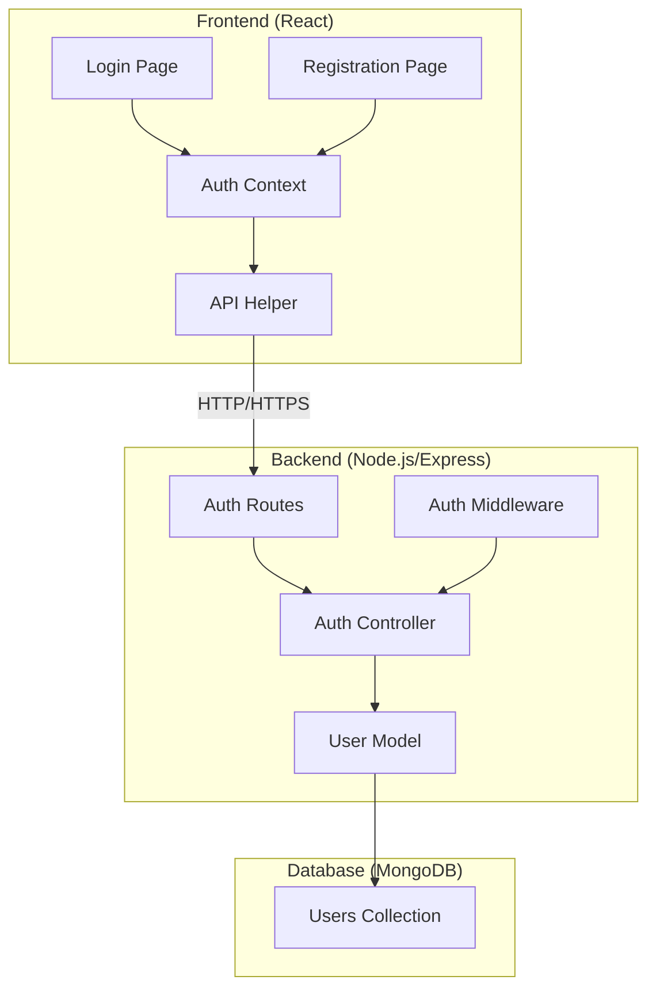

# Design Document: Authentication Pages

## Overview

This design document outlines the architecture and implementation details for the authentication system of the study group application. The system consists of React-based frontend pages for login and registration, a Node.js/Express backend API, and MongoDB for data persistence. The design emphasizes security, user experience, and maintainability.

## Architecture

### High-Level Architecture



### Technology Stack

**Frontend:**
- React 18+ for UI components
- React Router for client-side routing
- Axios for HTTP requests
- CSS modules or styled-components for styling
- React Hook Form for form management

**Backend:**
- Node.js with Express framework
- Mongoose for MongoDB object modeling
- bcryptjs for password hashing
- jsonwebtoken (JWT) for authentication tokens
- express-validator for input validation
- express-rate-limit for rate limiting
- cors for cross-origin resource sharing

**Database:**
- MongoDB for user data storage

## Components and Interfaces

### Frontend Components

#### 1. Login Page Component (`Login.jsx`)

**Responsibilities:**
- Render login form with email and password fields
- Handle form submission and validation
- Display error messages
- Redirect authenticated users
- Navigate to registration page

**Props:** None (uses React Router for navigation)

**State:**
- `formData`: { email: string, password: string }
- `errors`: { email?: string, password?: string, general?: string }
- `isLoading`: boolean

**Key Methods:**
- `handleInputChange(field, value)`: Updates form data
- `validateForm()`: Validates form inputs
- `handleSubmit(event)`: Submits login request to backend

#### 2. Registration Page Component (`Register.jsx`)

**Responsibilities:**
- Render registration form with username, email, and password fields
- Handle form submission and validation
- Display error messages
- Navigate to login page after successful registration

**Props:** None

**State:**
- `formData`: { username: string, email: string, password: string, confirmPassword: string }
- `errors`: { username?: string, email?: string, password?: string, confirmPassword?: string, general?: string }
- `isLoading`: boolean

**Key Methods:**
- `handleInputChange(field, value)`: Updates form data
- `validateForm()`: Validates form inputs including password confirmation
- `handleSubmit(event)`: Submits registration request to backend

#### 3. Auth Context (`AuthContext.jsx`)

**Responsibilities:**
- Manage global authentication state
- Provide authentication methods to components
- Store and manage JWT tokens
- Handle automatic logout on token expiration

**Context Value:**
- `user`: User object or null
- `token`: JWT string or null
- `isAuthenticated`: boolean
- `login(email, password)`: Async function
- `register(userData)`: Async function
- `logout()`: Function
- `checkAuth()`: Function to verify token validity

#### 4. Protected Route Component (`ProtectedRoute.jsx`)

**Responsibilities:**
- Wrap routes that require authentication
- Redirect unauthenticated users to login

### Backend Components

#### 1. Auth Routes (`routes/auth.js`)

**Endpoints:**

```javascript
POST /api/auth/register
POST /api/auth/login
GET /api/auth/verify
POST /api/auth/logout
```

#### 2. Auth Controller (`controllers/authController.js`)

**Methods:**

- `register(req, res)`: Handles user registration
  - Validates input data
  - Checks for existing email
  - Hashes password
  - Creates user in database
  - Returns success message

- `login(req, res)`: Handles user login
  - Validates credentials
  - Compares password hash
  - Generates JWT token
  - Returns token and user data

- `verifyToken(req, res)`: Verifies JWT token validity
  - Checks token expiration
  - Returns user data if valid

- `logout(req, res)`: Handles logout (optional for JWT)
  - Clears any server-side session data if applicable

#### 3. Auth Middleware (`middleware/auth.js`)

**Functions:**

- `authenticateToken(req, res, next)`: Verifies JWT from request headers
- `validateRegistration(req, res, next)`: Validates registration input
- `validateLogin(req, res, next)`: Validates login input
- `rateLimiter`: Limits authentication attempts

## Data Models

### User Model (MongoDB Schema)

```javascript
{
  username: {
    type: String,
    required: true,
    unique: true,
    trim: true,
    minlength: 3,
    maxlength: 30
  },
  email: {
    type: String,
    required: true,
    unique: true,
    lowercase: true,
    trim: true,
    match: /^[^\s@]+@[^\s@]+\.[^\s@]+$/
  },
  password: {
    type: String,
    required: true,
    minlength: 6
  },
  createdAt: {
    type: Date,
    default: Date.now
  },
  updatedAt: {
    type: Date,
    default: Date.now
  }
}
```

**Indexes:**
- Unique index on `email`
- Unique index on `username`

### JWT Payload Structure

```javascript
{
  userId: string,
  email: string,
  iat: number,  // issued at
  exp: number   // expiration (24 hours from issue)
}
```

## 
Correctness Properties

*A property is a characteristic or behavior that should hold true across all valid executions of a system—essentially, a formal statement about what the system should do. Properties serve as the bridge between human-readable specifications and machine-verifiable correctness guarantees.*

### Property 1: Valid registration creates user account

*For any* valid user data (username, email, password meeting requirements), submitting a registration request should result in a new user record being created in the database with the provided information.

**Validates: Requirements 1.2**

### Property 2: Duplicate email registration is rejected

*For any* email address that already exists in the database, attempting to register a new account with that email should be rejected and return an appropriate error message.

**Validates: Requirements 1.3**

### Property 3: Form validation detects all invalid inputs

*For any* registration or login form input that violates validation rules (invalid email format, password too short, empty required fields), the system should display specific error messages identifying each validation failure.

**Validates: Requirements 1.4, 4.1, 4.3**

### Property 4: Valid credentials authenticate successfully

*For any* user account that exists in the database, providing the correct email and password should result in successful authentication and return a valid JWT token.

**Validates: Requirements 2.2**

### Property 5: Invalid credentials are rejected

*For any* login attempt with incorrect credentials (wrong password or non-existent email), the system should reject the authentication and return an error message without revealing which credential was incorrect.

**Validates: Requirements 2.3**

### Property 6: Authenticated users are redirected from auth pages

*For any* user who is already authenticated (has valid JWT token), attempting to access the login or registration pages should result in automatic redirection to the dashboard.

**Validates: Requirements 2.5**

### Property 7: Passwords are hashed before storage

*For any* password provided during registration, the value stored in the database should be a bcrypt hash, not the plain text password, and the hash should be verifiable against the original password.

**Validates: Requirements 3.1**

### Property 8: Error messages clear when input is corrected

*For any* form field that displays a validation error, correcting the input to meet validation requirements should result in the error message being removed.

**Validates: Requirements 4.4**

### Property 9: Real-time validation provides feedback

*For any* form field with validation rules, as the user types, the system should provide immediate validation feedback without requiring form submission.

**Validates: Requirements 4.5**

### Property 10: Backend validates all registration inputs

*For any* registration request received by the backend, input validation should occur before any database operations, and invalid requests should be rejected with appropriate error messages.

**Validates: Requirements 6.1**

### Property 11: Error responses include appropriate HTTP status codes

*For any* error condition (validation failure, authentication failure, server error), the backend should return an HTTP response with the appropriate status code (400 for bad request, 401 for unauthorized, 500 for server error, etc.) and a descriptive error message.

**Validates: Requirements 6.4**

## Error Handling

### Frontend Error Handling

**Validation Errors:**
- Display inline error messages below form fields
- Highlight invalid fields with red borders
- Prevent form submission until all validation passes
- Clear errors when user corrects input

**API Errors:**
- Display general error messages for network failures
- Show specific error messages from backend responses
- Handle timeout scenarios with retry options
- Provide user-friendly messages for technical errors

**Authentication Errors:**
- Display "Invalid credentials" for login failures (without specifying which field)
- Show "Email already exists" for duplicate registration
- Handle token expiration with automatic logout and redirect

### Backend Error Handling

**Validation Errors (400):**
- Return detailed validation error messages
- Include field-specific error information
- Use consistent error response format

**Authentication Errors (401):**
- Return generic "Invalid credentials" message for login failures
- Return "Unauthorized" for invalid/expired tokens
- Do not reveal whether email exists during login

**Conflict Errors (409):**
- Return "Email already registered" for duplicate emails
- Return "Username already taken" for duplicate usernames

**Server Errors (500):**
- Log detailed error information server-side
- Return generic error message to client
- Implement error monitoring/alerting

**Rate Limiting (429):**
- Return "Too many requests" message
- Include retry-after header
- Log potential brute force attempts

### Error Response Format

```javascript
{
  success: false,
  error: {
    message: "User-friendly error message",
    code: "ERROR_CODE",
    field: "fieldName", // optional, for validation errors
    details: {} // optional, additional context
  }
}
```

## Testing Strategy

### Unit Testing

**Frontend Unit Tests:**
- Test form validation logic in isolation
- Test component rendering with different props/states
- Test error message display logic
- Test navigation behavior
- Test API helper functions

**Backend Unit Tests:**
- Test password hashing and comparison
- Test JWT token generation and verification
- Test validation middleware
- Test controller functions with mocked database
- Test error handling logic

**Tools:**
- Jest for test runner
- React Testing Library for component tests
- Supertest for API endpoint tests
- MongoDB Memory Server for database tests

### Property-Based Testing

**Property-Based Testing Library:**
- Use **fast-check** for JavaScript/TypeScript property-based testing
- Configure each property test to run a minimum of 100 iterations

**Property Test Requirements:**
- Each property-based test MUST be tagged with a comment referencing the correctness property
- Tag format: `// Feature: auth-pages, Property {number}: {property_text}`
- Each correctness property MUST be implemented by a SINGLE property-based test

**Property Tests to Implement:**

1. **Registration with valid data** (Property 1)
   - Generate random valid usernames, emails, and passwords
   - Verify user creation in database
   - Verify password is hashed

2. **Duplicate email rejection** (Property 2)
   - Generate random user data
   - Register user, then attempt duplicate registration
   - Verify rejection and error message

3. **Form validation** (Property 3)
   - Generate various invalid inputs (malformed emails, short passwords, empty fields)
   - Verify appropriate error messages for each case

4. **Valid login authentication** (Property 4)
   - Generate random users and register them
   - Login with correct credentials
   - Verify JWT token is returned and valid

5. **Invalid credentials rejection** (Property 5)
   - Generate random users
   - Attempt login with wrong passwords or non-existent emails
   - Verify rejection without credential disclosure

6. **Authenticated user redirection** (Property 6)
   - Generate authenticated users
   - Attempt to access auth pages
   - Verify redirection occurs

7. **Password hashing** (Property 7)
   - Generate random passwords
   - Register users and verify stored passwords are hashed
   - Verify hashes can be validated against original passwords

8. **Error message clearing** (Property 8)
   - Generate invalid inputs that trigger errors
   - Correct the inputs
   - Verify error messages are removed

9. **Real-time validation** (Property 9)
   - Simulate typing in form fields
   - Verify validation feedback appears without submission

10. **Backend input validation** (Property 10)
    - Generate various valid and invalid registration payloads
    - Verify validation occurs before database operations

11. **HTTP status codes** (Property 11)
    - Generate various error conditions
    - Verify appropriate status codes are returned

### Integration Testing

- Test complete registration flow (frontend → backend → database)
- Test complete login flow with token generation
- Test protected route access with valid/invalid tokens
- Test CORS configuration
- Test rate limiting behavior

### End-to-End Testing

- Test user registration through UI
- Test user login through UI
- Test navigation between auth pages
- Test form validation in browser
- Test responsive design on different screen sizes

## Security Considerations

### Password Security

- Minimum password length: 6 characters (configurable)
- Use bcryptjs with salt rounds: 10
- Never log or expose passwords in responses
- Implement password strength indicator (optional enhancement)

### Token Security

- JWT tokens expire after 24 hours
- Store tokens in httpOnly cookies (preferred) or localStorage
- Include token expiration check on protected routes
- Implement token refresh mechanism (optional enhancement)

### API Security

- Implement rate limiting: 5 requests per minute per IP for auth endpoints
- Use CORS to restrict API access to authorized origins
- Validate and sanitize all user inputs
- Use HTTPS in production
- Implement CSRF protection for cookie-based auth

### Data Security

- Never expose password hashes in API responses
- Implement proper MongoDB indexes for performance
- Use environment variables for sensitive configuration
- Implement request logging for security monitoring

## Performance Considerations

- Implement database connection pooling
- Add indexes on email and username fields
- Use React.memo for form components to prevent unnecessary re-renders
- Implement debouncing for real-time validation
- Lazy load authentication pages
- Minimize bundle size with code splitting

## Deployment Considerations

- Set up environment variables for:
  - MongoDB connection string
  - JWT secret key
  - Frontend URL for CORS
  - Rate limiting configuration
- Configure HTTPS/SSL certificates
- Set up error logging and monitoring
- Implement health check endpoints
- Configure proper CORS policies for production
